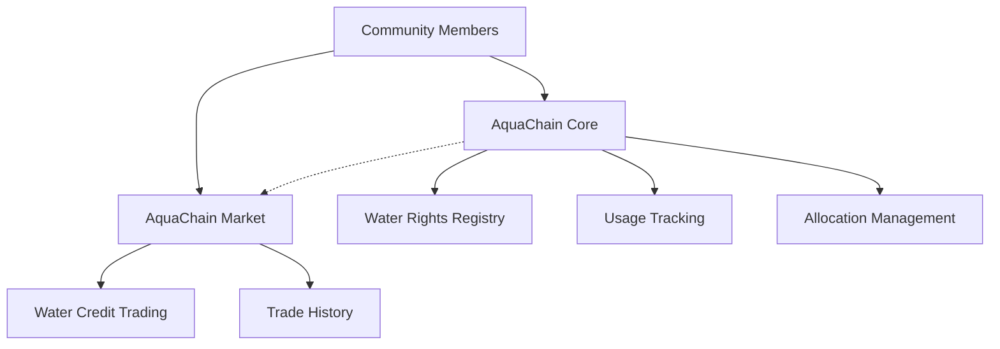

# AquaChain Water Resource Management

A decentralized solution for transparent and efficient management of community water resources, enabling tracking of water rights, allocation permissions, usage monitoring, and trading of water quotas.

## Overview

AquaChain creates a transparent and accountable system for water resource management within communities. The platform consists of two main components:

1. **Core Water Management** - Handles water rights registration, allocation tracking, and usage monitoring
2. **Water Market** - Facilitates trading of water credits between users who have excess allocation and those who need additional resources

### Key Features

- Water source registration and management
- User water rights and allocation tracking
- Usage monitoring and quota enforcement
- Transparent water credit trading marketplace
- Historical usage and trading records
- Administrative controls for community governance

## Architecture

The system is built on two primary smart contracts that work together to provide comprehensive water resource management:



### Core Contract
Manages fundamental water resource operations including:
- Water source registration
- User rights management
- Usage tracking
- Quota enforcement

### Market Contract
Handles the economic aspects including:
- Water credit listings
- Bid management
- Trade execution
- Commission handling

## Contract Documentation

### AquaChain Core (`aquachain-core.clar`)

The central registry for water management within a community.

#### Key Functions:

```clarity
(define-public (register-water-source (name (string-ascii 50)) (location (string-ascii 100)) (capacity uint)))
(define-public (register-user (user principal) (initial-allocation uint)))
(define-public (record-usage (user principal) (amount uint)))
(define-public (transfer-allocation (recipient principal) (amount uint)))
```

### AquaChain Market (`aquachain-market.clar`)

Facilitates the trading of water allocation credits between users.

#### Key Functions:

```clarity
(define-public (create-listing (amount uint) (price-per-unit uint) (description (string-utf8 100))))
(define-public (place-bid (listing-id uint) (amount uint) (price-per-unit uint)))
(define-public (accept-bid (bid-id uint)))
```

## Getting Started

### Prerequisites

- Clarinet CLI installed
- Stacks blockchain development environment
- STX wallet for testing

### Installation

1. Clone the repository
2. Install dependencies:
```bash
clarinet install
```

3. Deploy contracts:
```bash
clarinet deploy
```

### Basic Usage

1. Register a water source:
```clarity
(contract-call? .aquachain-core register-water-source "Mountain Spring" "North Basin" u1000000)
```

2. Register a user:
```clarity
(contract-call? .aquachain-core register-user tx-sender u10000)
```

3. Create a water credit listing:
```clarity
(contract-call? .aquachain-market create-listing u1000 u100 "Available water credits")
```

## Function Reference

### Core Contract Functions

| Function | Description | Parameters |
|----------|-------------|------------|
| `register-water-source` | Registers a new water source | name, location, capacity |
| `register-user` | Registers a new user with initial allocation | user, initial-allocation |
| `record-usage` | Records water usage for a user | user, amount |
| `transfer-allocation` | Transfers allocation between users | recipient, amount |

### Market Contract Functions

| Function | Description | Parameters |
|----------|-------------|------------|
| `create-listing` | Creates a new water credit listing | amount, price-per-unit, description |
| `place-bid` | Places a bid on a listing | listing-id, amount, price-per-unit |
| `accept-bid` | Accepts a bid and executes trade | bid-id |

## Development

### Testing

Run the test suite:
```bash
clarinet test
```

### Local Development

1. Start Clarinet console:
```bash
clarinet console
```

2. Deploy contracts locally:
```clarity
(contract-call? .aquachain-core initialize)
```

## Security Considerations

1. Access Control
   - Administrative functions are protected with proper authorization checks
   - User operations are restricted to their own resources

2. Resource Limitations
   - Water allocations are strictly enforced
   - Usage cannot exceed allocated amounts
   - Trading requires sufficient water credits and funds

3. Data Validation
   - All inputs are validated before processing
   - Negative values are prevented
   - Overflow checks are implemented

4. Market Safety
   - Self-trading is prevented
   - Commission rates are capped
   - Trade execution is atomic